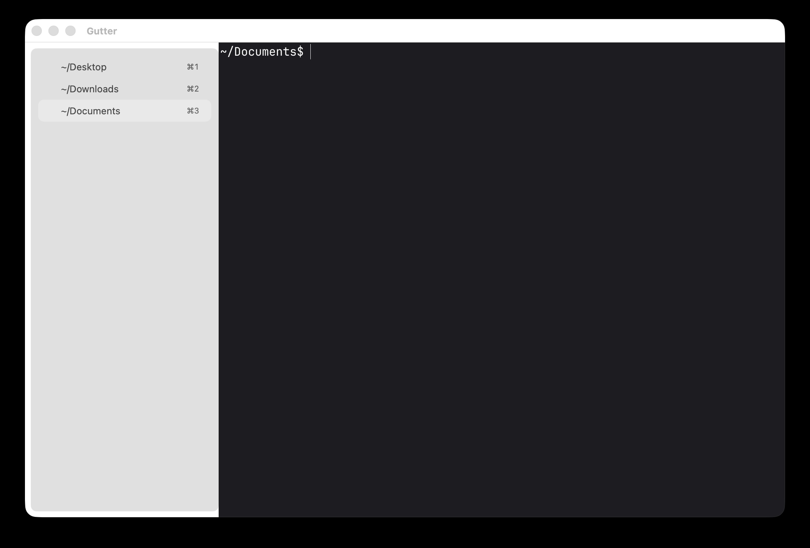

# Gutter

A small native macOS terminal app with a vertical tab sidebar, embedding
[libghostty](https://ghostty.org) (ghostty **v1.3.1**) as a static library.



One window, one collapsible sidebar. Every session is a real libghostty surface -
Metal rendering, PTY handling, VT emulation, input/IME and config loading all come
from ghostty's core and its own Swift wrapper. The app itself is ~700 lines of
AppKit (window shell, sidebar, session manager). No Xcode project: everything
builds with `swiftc` + scripts.

Config lives in `~/.config/gutter/config`, in ghostty's config syntax: theme,
font size, working directory and keybinds are read from there. First launch
creates it empty. Ghostty's own config files are never loaded - to inherit
them, add `config-file = ?~/.config/ghostty/config` (or the path to
`com.mitchellh.ghostty/config.ghostty`; `?` means "skip if missing").

See `BUILDING.html` for the rendered setup notes - prerequisites, build steps, layout, gotchas.

## Why this exists

Ghostty is fast and has no vertical tabs. iTerm2 has vertical tabs and is not
Ghostty. Gutter is the overlap: ghostty's core and renderer, driven by a sidebar
of full-height sessions instead of a horizontal tab bar.

That gap is permanent, not pending. Ghostty declined vertical tabs in
[discussion #2549](https://github.com/ghostty-org/ghostty/discussions/2549),
closed and locked on 2026-03-13 - custom tab bars conflict with ghostty's
preference for native platform UI, and the maintainer points people at forks
instead.

It also began as a question: can a separate app embed libghostty and drive it?
Yes, in ~700 lines of AppKit. Gutter is that experiment.

**Not a fork.** Gutter links the released `libghostty` static library and brings
its own AppKit shell. Following upstream means auditing one file
(`GhosttyBridge`) for API drift, not rebasing a patched copy of ghostty's source.

**Not a product.** No splits, no scrollback search, no session restore, no test
suite. For a full-featured terminal, use Ghostty or iTerm2.

## Architecture

Runtime ownership, top to bottom:

```
main.swift            process setup: GHOSTTY_RESOURCES_DIR, ghostty_init, keybind overrides
└─ AppDelegate        app lifecycle + menu actions
   ├─ Ghostty.App     libghostty runtime + config (from Vendor/)
   ├─ GhosttyBridge   the only place that knows ghostty's notification names
   ├─ SessionManager  the session list and which one is selected
   └─ MainWindowController          window, toolbar, fullscreen chrome
      └─ MainSplitViewController
         ├─ SidebarViewController            one table row per session
         └─ TerminalContainerViewController  hosts the selected SurfaceView
```

`SessionManager` is the model: it owns sessions and holds no AppKit policy.
`MainWindowController` owns every session-to-UI reaction - sidebar reload, showing the
selected surface, handing it first responder. `GhosttyBridge` translates libghostty
notifications into session calls; it is the file to audit for API drift when ghostty is
updated. A `Session` is a live `Ghostty.SurfaceView` plus sidebar state (title, activity
dot) - the surface is the real terminal.

## Layout

| Path | Purpose |
|---|---|
| `Sources/` | App code: `AppDelegate` (lifecycle + menu actions), `MainWindowController` (window, toolbar, fullscreen), `GhosttyBridge` (libghostty boundary), `SessionManager` (sessions, tabs), `SidebarViewController`, `MainSplitViewController.swift` (split view + surface container) |
| `Sources/Shims.swift` | Stub types the vendored wrapper `as?`-casts to (no-op in this app) |
| `Sources/Compat.swift` | Shims for Swift-overlay APIs missing from the CommandLineTools toolchain |
| `Vendor/` | Swift wrapper copied from the ghostty checkout by `vendor.sh` (SurfaceView with input/IME, config, app runtime) |
| `deps/` | Self-contained build inputs: stripped static `libghostty.a`, C headers/modulemap, resources (themes, terminfo) - committed, so no ghostty checkout is needed to build |
| `vendor.sh` | Re-copies + patches the wrapper (patches live here, reproducible) |
| `build.sh` / `make-app.sh` | Build the binary / assemble `dist/Gutter.app` (bundles themes + shell integration + terminfo) |
| `Info.plist` | Bundle metadata (bundle id, min macOS 13) |

## Requirements

- macOS 13+ (built and tested on 26.x, arm64)
- Xcode installed at `/Applications/Xcode.app` with the **Metal Toolchain**
  component (Xcode Settings -> Components)

That's it - `deps/` carries the vendored libghostty, headers and resources, so
cloning the repo is enough to build. A ghostty checkout + Zig 0.15.2 are only
needed when **updating** ghostty (see "Updating ghostty").

## Build & run

```sh
cd ak/gutter
./build.sh      # compile app + vendored wrapper, link libghostty
./make-app.sh   # assemble dist/Gutter.app (bundles themes + shell integration + terminfo)
open dist/Gutter.app
```

`build.sh` prefers the committed `deps/` (stripped static `libghostty` +
headers + resources). Setting `GHOSTTY=<checkout>` overrides it and links the
checkout's GhosttyKit.xcframework instead (with the archive-repair workaround
below if needed). Always run the app from the bundled `.app` - the bare binary
crashes because ghostty's logger force-unwraps
`Bundle.main.bundleIdentifier`.

## Developing

- **App code**: edit `Sources/`, then `./build.sh && ./make-app.sh`. There is no
  Xcode project; iterate with the scripts.
- **Fast syntax check** (no linking): run the `swiftc -typecheck` command inside
  `build.sh` by hand, or just run `./build.sh` - it is fast once the archives are
  repaired.
- **Vendored wrapper**: to pull in ghostty changes, re-run `./vendor.sh`. The
  patches applied on top of upstream (missing imports, a ForEach rewrite, the
  `goto_tab` performability guard, an embedder config-file hook) are asserted
  with occurrence counts - they fail loudly if upstream drifts, and then need a
  look.
- **Runtime logs**: ghostty logs through os.Logger. Watch with
  `/usr/bin/log stream --style compact --predicate 'process == "Gutter"'`
  (config errors, renderer health, spawn failures all show up there).
- **Keybind overrides** (`cmd+t=new_tab`, `cmd+9=goto_tab:9`) are injected via a
  temp config file from `main.swift` through `Ghostty.Config.embedderConfigFile`.
  The core has no default `cmd+t` on macOS (upstream handles it in their app
  menu), and goto_tab only defaults to 1-8.
- Don't override `command` in config overrides: repeated `command` keys append
  to the default argv instead of replacing it.

## Updating ghostty (rare)

Only needed when you want a newer ghostty core. Requires a ghostty checkout
and Zig 0.15.2:

```sh
cd <ghostty-checkout>
git fetch && git checkout <new-tag>
PATH="<tooling-dir>/shim-bin:$PATH" \
  zig build -Doptimize=ReleaseFast -Demit-macos-app=false -Dxcframework-target=native
```

The `shim-bin` xcrun wrapper points zig's SDK detection at a shadow SDK
(`<tooling-dir>/MacOSX26.5-arm64.sdk`) whose tbds declare
`arm64-macos` - macOS 26 SDKs dropped it and zig 0.15.2's linker requires it.
Then refresh the vendored inputs in this repo:

1. `./vendor.sh` - refresh the Swift wrapper (patch assertions fail loudly on
   upstream drift)
2. Refresh `deps/`:
   - copy `include/` and `zig-out/share/{ghostty,terminfo}` from the checkout
   - rebuild the static lib: extract every `lib*.a` from the checkout's
     `.zig-cache/o` (zig's archives have members Xcode's libtool drops for
     missing 8-byte padding - rebuild each with Apple's `ar` first), run
     `strip -S` on the objects (drops debug info: 135M -> 23M), then
     `ar rcs deps/lib/libghostty.a *.o`
3. `./build.sh` with `GHOSTTY=<checkout>` unset falls back to `deps/` - verify,
   commit `Vendor/` + `deps/`.

## Sharing the binary

`dist/Gutter.app` is self-contained (static libghostty, themes, shell
integration) - just zip it:

```sh
cd gutter/dist && zip -r Gutter.zip Gutter.app
```

Recipients should know:

- **arm64 (Apple Silicon) only**, macOS 13+.
- The app is **ad-hoc signed** (no developer certificate). On another Mac,
  Gatekeeper will block the first launch: right-click -> Open, or clear the
  quarantine flag with `xattr -cr Gutter.app`.
- It reads `~/.config/gutter/config`, not any Ghostty config; on a fresh
  machine that file is created empty, so it runs with ghostty's default theme.
- The embedded libghostty is MIT-licensed (c) Mitchell Hashimoto /
  ghostty contributors; keep that attribution if you redistribute.

## Keybinds

Every one of these also appears in the in-app list (Help -> Keyboard
Shortcuts, `cmd-shift-/`), which is built by hand in
`ShortcutsWindowController.swift`. Adding a keybind means editing three places:
`MainMenu.swift`, that list, and this table.

| Keys | Action |
|---|---|
| `cmd-t` / `cmd-w` | New tab / close tab (ghostty core keybinds -> notifications -> sidebar) |
| `cmd-shift-r` | Rename tab |
| `cmd-1..9` | Select tab N |
| `ctrl-tab` / `ctrl-shift-tab` | Next / previous tab |
| `cmd-b` or toolbar button | Toggle sidebar |
| `ctrl-shift-g` | Show uncommitted changes |
| `cmd-f` / `cmd-g` / `cmd-shift-g` | Find in scrollback / next / previous |
| `cmd-e` | Use selection for find |
| `cmd-,` / `cmd-shift-,` | Open / reload the Gutter config (`~/.config/gutter/config`) |
| `cmd-shift-/` | Keyboard shortcuts |

In the uncommitted-changes window: `cmd-]` / `cmd-[` next and previous change,
`cmd-r` refresh, `cmd-w` close.

Links belong to ghostty, not to this table: `cmd`-hover underlines a URL and
`cmd`-click opens it. Inside a program that captures the mouse (Claude Code,
vim) that does nothing - the program owns the pointer, which is also why it
turns into an arrow there. Add `shift`: `shift-cmd`-hover hands the mouse back
to the terminal (`mouse-shift-capture`, off by default) and the link lights up
again. Upstream Ghostty behaves identically.

## Troubleshooting

- **Config errors at launch**: check the unified log (command above) for
  `config error:` lines. Theme not found usually means the bundled themes are
  missing from the app's `Contents/Resources/ghostty/themes` - re-run
  `make-app.sh`.
- **App quits when the last tab closes**: intentional (matches Terminal.app
  behavior).
- **No tab titles**: titles come from the shell (your zsh config reports cwd);
  a fresh shell shows the ghost fallback until the first prompt draws.
